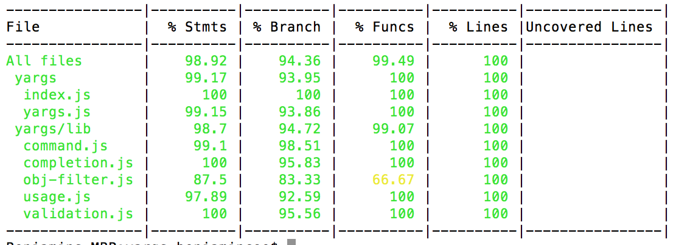
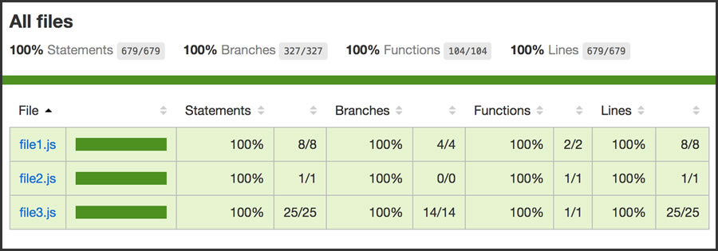

# Unit test
## 2.1 Unit test là gì?
- Định nghĩa: Unit test là quá trình kiểm thử từng phần nhỏ nhất của code, thường là từng function hoặc class/component.
- Mục đích:
  - Đảm bảo logic từng phần nhỏ nhất của code hoạt động đúng như mong đợi.
  - Phát hiện lỗi sớm, giúp giảm thiểu lỗi ở các phần khác của hệ thống.
  - Tăng cường sự tự tin khi thay đổi code, giúp dễ dàng refactor code mà không lo lỗi.

## 2.2 Viết unit test hiệu quả
- Cấu trúc của 1 test case thường tuân thủ theo mô hình AAA:
  - **Arrange**: Chuẩn bị dữ liệu cần thiết cho test case.
  - **Act**: Thực thi hành động cần kiểm thử.
  - **Assert**: So sánh kết quả thực tế với kết quả mong đợi.
- Quy tắc **FIRST** trong Unit Test:
  - **F**ast: Test case phải chạy nhanh.
  - **I**ndependent: Test case phải chạy độc lập.
  - **R**epeatable: Test case phải chạy giống nhau mỗi lần chạy.
  - **S**elf-validating: Test case phải tự đánh giá kết quả.
  - **T**imely: Viết đúng thời điểm, test case được viết ra trước khi viết code.

**Vi phạm nguyên tắc Repeatable (Có thể lặp lại)**

🔴 Ví dụ sai: Test này phụ thuộc vào thời gian thực (`Date.now()`), mỗi lần chạy có thể cho kết quả khác nhau.

```ts
test("should generate a unique order ID", () => {
  const orderId1 = `ORDER-${Date.now()}`;
  const orderId2 = `ORDER-${Date.now()}`;
  expect(orderId1).toBe(orderId2); // Lỗi vì thời gian thay đổi
});
```
✅ Cách viết đúng: Mock Date.now() để đảm bảo test chạy lại vẫn cho kết quả như nhau.

```ts
test("should generate a unique order ID", () => {
  const mockDateNow = jest.spyOn(Date, "now").mockReturnValue(0);
  const orderId1 = `ORDER-${Date.now()}`;
  const orderId2 = `ORDER-${Date.now()}`;
  expect(orderId1).toBe(orderId2); // Pass vì Date.now() trả về giá trị cố định
  mockDateNow.mockRestore();
});
```

**Vi phạm nguyên tắc Self-validating (Tự xác thực)**

🔴 Ví dụ sai: Test này không có bất kỳ expect() nào để xác thực kết quả, chỉ log ra console.

```ts
test("should return correct user data", async () => {
  const user = await fetchUser(1);
  console.log(user); // Không có kiểm tra kết quả
});
```
✅ Cách viết đúng: Sử dụng expect() để kiểm tra kết quả trả về.

```ts
test("should return correct user data", async () => {
  const user = await fetchUser(1);
  expect(user).toEqual({ id: 1, name: "Alice" });
});
```
## 2.3. Cấu trúc một file test
- Thư mục test thường được đặt tên theo cấu trúc `__tests__` hoặc `test`.
- Tên file test thường được đặt theo cấu trúc `<tên file>.test.<đuôi file>`.
- Cấu trúc một file test thường bao gồm:
  - Import các thư viện cần thiết.
  - Import file cần kiểm thử.
  - Viết test case sử dụng hàm `test()` hoặc `it()`.

```ts
// sum.test.ts
import { sum } from "../sum"; // Import file cần kiểm thử

describe("sum function", () => {
  test("returns correct sum for positive numbers", () => {
    expect(sum(2, 3)).toBe(5);
  });

  test("returns correct sum for negative numbers", () => {
    expect(sum(-2, -3)).toBe(-5);
  });

  test("returns correct sum for mixed numbers", () => {
    expect(sum(-2, 3)).toBe(1);
  });
});
```

## 2.3.1. Các thành phần và cú pháp quan trọng

1. **describe()**: Dùng để nhóm các test case liên quan lại với nhau.

```ts
describe("sum function", () => {
  // Các test case liên quan đến hàm sum
});
```

- `describe()` có thể dùng để mô tả cho một hàm, một module, một component, một API, một class, một nhóm test case, một trường hợp test. `describe()` có thể chứa nhiều `describe()` khác bên trong.
- Sử dụng prefix `.` để mô tả các instance method của một class hoặc property của một object. Sử dụng prefix `#` để mô tả các static method của một class hoặc static property của một object.

```ts
describe("Number", () => {
  describe(".toString()", () => {
    // Các test case liên quan đến hàm Number.toString()
  });

  describe(".toFixed()", () => {
    // Các test case liên quan đến hàm Number.toFixed()
  });

  describe("#parseInt", () => {
    // Các test case liên quan đến hàm Number.parseInt()
  });

  describe("#isNaN", () => {
    // Các test case liên quan đến hàm Number.isNaN()
  });
});
```

2. **test() hoặc it()**: Dùng để viết test case.

`it(description, callback)` hoặc `test(description, callback)` đều được sử dụng để define một test case cụ thể trong một describe block.

```ts
describe("Number", () => {
  describe(".toString()", () => {
    it("should return a string", () => {
      // Test case
    });
  });
});
```

`description` là mô tả ngắn gọn về test case, nó nên được mô tả ngắn gọn, theo ngôn ngữ tự nhiên:

❌ Bad:
```ts
it('calls handleSubmit and sets state to loading')
it('handles input')
it('success')
it('displays a loading indicator when the form is submitted')
```

✅ Good:
```ts
it('should submit the form and set the loading state') // Mô tả về hành vi mong đợi thay vì mô tả chi tiết cách code hoạt động
it('should display the user input')
it('should display a success message')
// Dùng describe() để mô tả trương hợp test, it để mô tả test case
discribe('when the form is submitted', () => {
  it('should display a loading indicator')
})
```

3. **expect()**: Dùng để so sánh kết quả thực tế với kết quả mong đợi.

Ví dụ một số matcher phổ biến:

```ts
expect(1 + 4).toBe(5); // So sánh bằng
expect({ id: 1 }).toEqual({ id: 1 }); // So sánh deep equal
expect([1, 2, 3]).toContain(2); // Kiểm tra phần tử có tồn tại trong mảng
expect("hello").toMatch(/hello/); // Kiểm tra chuỗi có match với regex
expect(() => { throw new Error("error") }).toThrow("error"); // Kiểm tra hàm có throw error
```

4. **beforeEach()** và **afterEach()**: Dùng để chạy một hàm trước mỗi test case hoặc sau mỗi test case.

```ts
let users = [];

// Reset users trước mỗi test case
beforeEach(() => {
  users = [{ id: 1, name: "Alice" }, { id: 2, name: "Bob" }];
});

it("should be able to add a new user", () => {
  users.push({ id: 3, name: "Charlie" });
  expect(users).toHaveLength(3);
});

it("should be able to remove a user", () => {
  users.pop();
  expect(users).toHaveLength(1);
});
```

5. **beforeAll()** và **afterAll()**: Dùng để chạy một hàm trước tất cả các test case hoặc sau tất cả các test case.

6. Mocking
- Mocking là kỹ thuật giả lập một hàm hoặc module khác để kiểm thử mà không cần phụ thuộc vào hàm hoặc module thật.

Ví dụ áp dụng mock để test function sau:

```ts
function handlePageLoad(productId) {
  return fetchProduct(productId)
    .then((data) => data.product)
    .catch(redirectToPageNotFound);
}
```

Vấn đề khi test function trên là phụ thuộc vào hàm `fetchProduct` và `redirectToPageNotFound`, để test đủ các trường hợp cần phải mock 2 hàm này.

```ts
import { handlePageLoad } from "~/pages/Product.vue";

describe("ProductPage", () => {
  describe("when product is loaded", () => {
    it("should return product data", async () => {
      const product = { id: 1, name: "Product 1" };
      jest.spyOn(ProductPage.methods, "fetchProduct").mockResolvedValue({ product });

      const data = await ProductPage.handlePageLoad(1);

      expect(data).toEqual(product);
    });
  });

  describe("when product is not found", () => {
    it("should redirect to 404 page", async () => {
      jest.spyOn(ProductPage.methods, "fetchProduct").mockRejectedValue(new Error("Not found"));
      const redirectToPageNotFound = jest.fn();

      await ProductPage.handlePageLoad(1);

      expect(redirectToPageNotFound).toHaveBeenCalled();
    });
  });
});
```
Giải thích:
- Sử dụng `jest.spyOn()` để mock hàm `fetchProduct` và `redirectToPageNotFound`.
- Sử dụng `mockResolvedValue()` để giả lập hàm trả về giá trị mong muốn.
- Sử dụng `mockRejectedValue()` để giả lập hàm trả về lỗi.
- Sử dụng `jest.fn()` để tạo một mock function.

**🎯 Khi nào dùng `jest.fn()` và `jest.spyOn()`?**
- Dùng jest.fn() khi muốn tạo một hàm giả lập từ đầu (thường dùng để mock API, database, hoặc callback).
- Dùng jest.spyOn() khi muốn theo dõi một hàm có sẵn mà không cần thay đổi hoàn toàn logic (thường dùng để kiểm tra console, gọi API, gọi method của class...).

## 2.4. Testing components

### 2.4.1. React component
- Sử dụng `@testing-library/react` để test React component.

```ts
import {render, screen} from '@testing-library/react'
import userEvent from '@testing-library/user-event'
import '@testing-library/jest-dom'
import Fetch from './fetch'

test('loads and displays greeting', async () => {
  // ARRANGE
  render(<Fetch url="/greeting" />)

  // ACT
  await userEvent.click(screen.getByText('Load Greeting'))
  await screen.findByRole('heading')

  // ASSERT
  expect(screen.getByRole('heading')).toHaveTextContent('hello there')
  expect(screen.getByRole('button')).toBeDisabled()
})
```

Cheatsheet: https://testing-library.com/docs/react-testing-library/cheatsheet

### 2.4.2. Vue component

- Sử dụng `@testing-library/vue` để test Vue component.

Ví dụ test component Counter.vue:

```vue
<template>
  <div>
    <p>Times clicked: {{ count }}</p>
    <button @click="increment">increment</button>
  </div>
</template>

<script>
  export default {
    data: () => ({
      count: 0,
    }),

    methods: {
      increment() {
        this.count++
      },
    },
  }
</script>
```

```ts
import {render, fireEvent, screen} from '@testing-library/vue'
import Component from './Component.vue'

test('increments value on click', async () => {
  render(Component)

  // screen has all queries that you can use in your tests.
  // getByText returns the first matching node for the provided text, and
  // throws an error if no elements match or if more than one match is found.
  screen.getByText('Times clicked: 0')

  const button = screen.getByText('increment')

  // Dispatch a native click event to our button element.
  await fireEvent.click(button)
  await fireEvent.click(button)

  screen.getByText('Times clicked: 2')
})
```

Ví dụ test v-model

```vue
<template>
  <div>
    <p>Hi, my name is {{ user }}</p>

    <label for="username">Username:</label>
    <input v-model="user" id="username" name="username" />
  </div>
</template>

<script>
  export default {
    data: () => ({
      user: 'Alice',
    }),
  }
</script>
```

```ts
import {render, fireEvent, screen} from '@testing-library/vue'
import Component from './Component.vue'

test('properly handles v-model', async () => {
  render(Component)

  // Asserts initial state.
  screen.getByText('Hi, my name is Alice')

  // Get the input DOM node by querying the associated label.
  const usernameInput = screen.getByLabelText(/username/i)

  // Updates the <input> value and triggers an `input` event.
  // fireEvent.input() would make the test fail.
  await fireEvent.update(usernameInput, 'Bob')

  screen.getByText('Hi, my name is Bob')
})
```

Cheatsheet: https://testing-library.com/docs/vue-testing-library/cheatsheet

### 2.4.3. Best practices

- **Render the component**: Sử dụng `render()` để render component cần test. Đối với Vue component, không nên sử dụng `shallowMount`.
- Thêm thuộc tính `data-testid` vào các element cần test để dễ dàng query.

## 2.5. Snapshot testing

## 2.6. Code coverage
### 2.6.1. 📌 Code Coverage là gì?
Code Coverage (Độ phủ mã) là thước đo cho biết bao nhiêu phần trăm code của bạn đã được kiểm tra bằng test. Mục tiêu của code coverage là đảm bảo rằng tất cả các nhánh logic quan trọng trong code đều được kiểm thử.

### 2.6.2. 📊 Các loại Code Coverage phổ biến
1. **Statement coverage**: Đo lường số lượng câu lệnh trong code đã được thực thi.
2. **Branch coverage**: Đo lường số lượng nhánh logic trong code đã được thực thi.
3. **Function coverage**: Đo lường số lượng function trong code đã được thực thi.
4. **Line coverage**: Đo lường số lượng dòng code đã được thực thi.

### 2.6.3. Ví dụ minh họa






### 2.6.4. 🎯 Những lưu ý quan trọng về Code Coverage
- ✅ Code Coverage cao không đảm bảo chất lượng test tốt. Test cần kiểm thử cả logic, edge case, hành vi người dùng.
- ✅ Mức coverage khuyến nghị:
  - 80% trở lên cho unit test.
  - 60-70% cho integration test.
  - E2E test không cần quá cao, quan trọng là mô phỏng đúng hành vi người dùng.
- ✅ Không nên chạy theo 100% coverage → Quan trọng nhất là kiểm thử đúng logic, chứ không phải chỉ đảm bảo số liệu.
